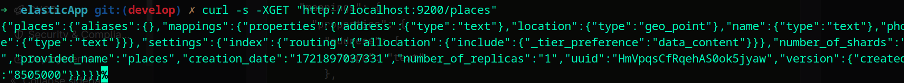
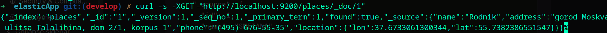
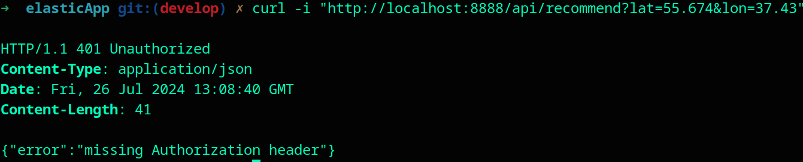
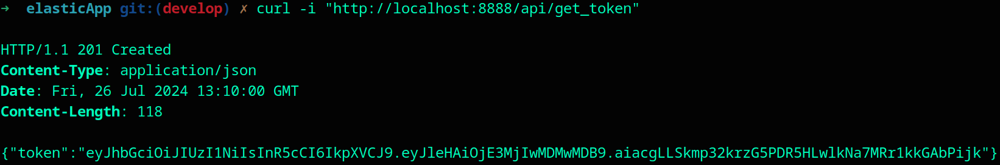
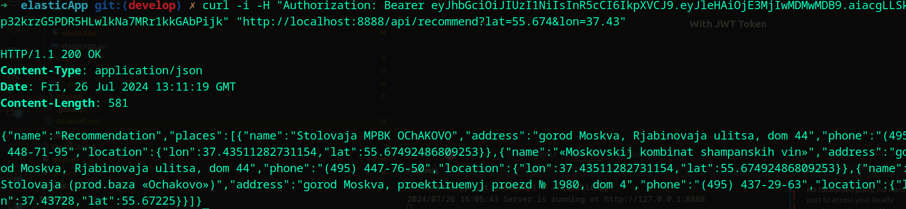

## ex00

* info about elastic shard



* fisrt doc in database



## ex01

* page example

```
curl -s -XGET "http://127.0.0.1:8888/\?page\=1" 
```

```
<!DOCTYPE html>
<html>
<head>
    <title>Places</title>
</head>
<body>
    <h1>Places, count of places = 13649</h1>
    <ul>
        
        <li>
            <strong>SMETANA</strong><br>
            Address: gorod Moskva, ulitsa Egora Abakumova, dom 9<br>
            Phone: (499) 183-14-10<br>
            Location: 55.879001531303366, 37.71456500043604<br>
        </li>
        
        <li>
            <strong>Rodnik</strong><br>
            Address: gorod Moskva, ulitsa Talalihina, dom 2/1, korpus 1<br>
            Phone: (495) 676-55-35<br>
            Location: 55.7382386551547, 37.6733061300344<br>
        </li>
        
        <li>
            <strong>Kafe «Akademija»</strong><br>
            Address: gorod Moskva, Abel&#39;manovskaja ulitsa, dom 6<br>
            Phone: (495) 662-30-10<br>
            Location: 55.7355114718314, 37.6696475969381<br>
        </li>
        
        <li>
            <strong>Cotto Ital&#39;janskaja Kofejnja</strong><br>
            Address: gorod Moskva, Abramtsevskaja ulitsa, dom 9, korpus 1<br>
            Phone: (499) 200-00-22<br>
            Location: 55.90408636984904, 37.57230613167112<br>
        </li>
        
        <li>
            <strong>GBOU «Shkola № 1430 imeni Geroja Sotsialisticheskogo Truda G.V. Kisun&#39;ko» Shkola № 1051</strong><br>
            Address: gorod Moskva, Uglichskaja ulitsa, dom 17<br>
            Phone: (499) 908-06-15<br>
            Location: 55.90401880066921, 37.56694<br>
        </li>
        
        <li>
            <strong>Brusnika</strong><br>
            Address: gorod Moskva, pereulok Sivtsev Vrazhek, dom 6/2<br>
            Phone: (495) 697-04-89<br>
            Location: 55.747390490526, 37.59812754843999<br>
        </li>
        
        <li>
            <strong>Bufet MTUSI</strong><br>
            Address: gorod Moskva, Aviamotornaja ulitsa, dom 8, stroenie 1<br>
            Phone: (495) 673-89-78<br>
            Location: 55.75516375097069, 37.71542539189804<br>
        </li>
        
        <li>
            <strong>Stolovaja MTUSI</strong><br>
            Address: gorod Moskva, Aviamotornaja ulitsa, dom 8, stroenie 1<br>
            Phone: (495) 273-89-78<br>
            Location: 55.75516375097069, 37.71542539189804<br>
        </li>
        
        <li>
            <strong>Kafe Gogieli</strong><br>
            Address: gorod Moskva, Aviamotornaja ulitsa, dom 49/1<br>
            Phone: (495) 361-38-50<br>
            Location: 55.749275989276555, 37.71995037885907<br>
        </li>
        
        <li>
            <strong>ShKOLA 735</strong><br>
            Address: gorod Moskva, Aviamotornaja ulitsa, dom 51<br>
            Phone: (495) 273-21-06<br>
            Location: 55.746325696672486, 37.72098869657803<br>
        </li>
        
    </ul>
    <div>
        
        
        <a href="/?page=2">Next</a>
        
    </div>
</body>
</html>
```

* http400 example
```
curl -s -XGET "http://127.0.0.1:8888/\?page\=100000" 
```

```
HTTP/1.1 400 Bad Request
Content-Type: text/plain; charset=utf-8
X-Content-Type-Options: nosniff
Date: Fri, 26 Jul 2024 13:19:33 GMT
Content-Length: 21

Invalid page number!

```

## ex02

```
curl -i "http://127.0.0.1:8888/api/places?page=3" 
```

```
HTTP/1.1 200 OK
Content-Type: application/json
Date: Fri, 26 Jul 2024 13:25:44 GMT
Content-Length: 1741

{"name":"places","total":13649,"places":[{"name":"Kafeterij","address":"gorod Moskva, Altuf'evskoe shosse, dom 56","phone":"(495) 707-04-39","location":{"lon":37.58783336201571,"lat":55.880805280152074}},{"name":"RAHIMKULOVA T.H.","address":"gorod Moskva, Altuf'evskoe shosse, dom 102B","phone":"(499) 908-11-65","location":{"lon":37.59132052872169,"lat":55.90406171774881}},{"name":"STOLOVAJa PRI GUP OB'EDINENNYJ KOMBINAT ShKOL'NOGO PITANIJa","address":"gorod Moskva, ulitsa Amundsena, dom 10","phone":"(499) 189-38-39","location":{"lon":37.657212875944,"lat":55.8530419802775}},{"name":"ShKOLA 1444","address":"gorod Moskva, Anadyrskij proezd, dom 55","phone":"(495) 474-73-33","location":{"lon":37.704196,"lat":55.879103}},{"name":"Marhal","address":"gorod Moskva, Angarskaja ulitsa, dom 1, korpus 2","phone":"(499) 906-00-59","location":{"lon":37.50979918389434,"lat":55.87179217383281}},{"name":"Gotika","address":"gorod Moskva, Angarskaja ulitsa, dom 39","phone":"(495) 483-11-50","location":{"lon":37.524521570801696,"lat":55.879112362577104}},{"name":"Gimnazija № 1527","address":"gorod Moskva, prospekt Andropova, dom 17, korpus 2","phone":"(499) 618-55-63","location":{"lon":37.66820550994687,"lat":55.68319929578544}},{"name":"Kafe «Hinkal'naja»","address":"gorod Moskva, prospekt Andropova, dom 26","phone":"(499) 612-60-09","location":{"lon":37.6630949603141,"lat":55.68051266827809}},{"name":"Sushi Wok","address":"gorod Moskva, prospekt Andropova, dom 30","phone":"(499) 754-44-44","location":{"lon":37.662706040007905,"lat":55.6788166451702}},{"name":"Ryba i mjaso na ugljah","address":"gorod Moskva, prospekt Andropova, dom 35A","phone":"(499) 612-82-69","location":{"lon":37.66626689310591,"lat":55.67396575768212}}]}
```

## ex04 & ex03

* Without JWT Token



* ...Generate JWT



* With JWT Token

